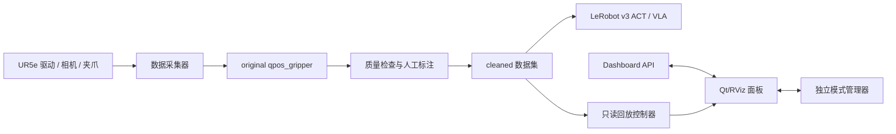

# UR5e Data Pipeline

这是一个面向 UR5e 机器人的 ROS 2 数据采集与回放工作区，交付内容由两个相互配合的包组成：

本项目由陈润泽独立完成，面向机器人学习数据工程、ROS 2 系统集成和可复现实验流程。仓库展示的是可运行的研究型工程原型，而不是完整的商用机器人控制栈。

| 包 | 作用 | 技术栈 |
| --- | --- | --- |
| `data_collection_pkg` | 采集、同步、质量检查、清洗、标注、LeRobot 转换、Dashboard 后端和安全回放 | Python、ROS 2 |
| `data_collection_rviz_panel` | Qt/RViz 操作界面、模式管理器入口、采集控制、转换、回放显示和状态监控 | C++、Qt5、RViz2 |

## 边界

数据管道只负责读取硬件状态、写入数据集、检查质量和发布只读回放数据。它不启动 UR 驱动，不向真实机械臂发送运动命令，也不实现 ACT/VLA 策略控制。

控制模式由独立的模式管理器负责。Qt 面板通过 `/control_mode/request` 和 `/control_mode/status` 与模式管理器交互；`teleop`、`http`、`act`、`vla` 是采集分类，不是控制器实现。控制器、模式管理器、相机驱动和夹爪驱动属于外部运行时依赖。

## 目录

```text
data_collection_pkg/          Python ROS 2 数据管道包
data_collection_rviz_panel/   C++ Qt/RViz2 操作面板包
```

仓库不包含 `build/`、`install/`、`log/` 等构建产物，也不包含开发计划和临时项目文档。

## 项目亮点

- 以场景相机 `header.stamp` 为采样锚点，统一匹配腕部相机、关节和夹爪状态。
- 将采集分类与控制模式解耦，支持 `teleop`、`http`、`act`、`vla` 四类数据目录。
- 提供原始数据标注、质量门禁、清洗审计、LeRobot v3 ACT/VLA 导出和项目自定义 HDF5 v1 交换格式。
- 使用独立的回放话题和 `replay/` TF 前缀，避免向真机控制器发送命令。
- Qt/RViz 面板通过 Dashboard API 和模式管理器协同工作，实时话题 active 时自动保护回放。

## 系统架构



## 界面与演示

下面的截图来自 Qt/RViz 操作面板，展示了模式控制、采集、回放时间轴、相机画面、遥测曲线和健康状态：

完整的产品手册见 [`docs/UI_USER_MANUAL.md`](docs/UI_USER_MANUAL.md)，其中包含所有按钮、状态输出、采集/清洗/转换/回放流程、接口话题和故障排查说明。


仓库不直接提交真机演示视频和数据集，以控制仓库体积并避免暴露运行环境信息。

## 环境依赖

基础环境：

- Ubuntu 22.04
- ROS 2 Humble
- Python 3、`rclpy`、`numpy`、Flask
- CMake、Qt5 Widgets/Network、RViz2
- `robot_state_publisher`、`tf2_ros`、机器人描述包

可选依赖：

- LeRobot v3：用于 ACT/VLA 数据集导出和验证，详见 `data_collection_pkg/requirements-lerobot.txt`。
- 真机 UR 驱动、相机驱动、夹爪驱动和独立模式管理器。

`serial-ros2` 是工作区中单独存在的第三方 C++ 串口通信库，来源为 `RoverRobotics-forks/serial-ros2`。它不是本仓库的 Git 子目录，也不是这两个交付包的直接依赖；通常由外部 Robotiq/硬件包使用。不要把它的源码、构建结果或修改混入本仓库提交。

## 构建

将两个包放入 ROS 2 工作区的 `src/` 目录后执行：

```bash
source /opt/ros/humble/setup.bash
rosdep install --from-paths src --ignore-src -r -y
colcon build --symlink-install --packages-select \
  data_collection_pkg data_collection_rviz_panel
source install/setup.bash
```

快速检查：

```bash
ros2 pkg executables data_collection_pkg
ros2 pkg executables data_collection_rviz_panel
ros2 run data_collection_pkg data_collection list-schemas
```

## 真机启动顺序

1. 启动 UR 驱动、机器人描述、相机和夹爪驱动。
2. 确认 `/joint_states`、两路压缩图像和夹爪状态话题正在发布。
3. 启动独立模式管理器；需要控制服务时再启动 HTTP API。
4. 启动 Qt/RViz 面板：

```bash
ros2 launch data_collection_rviz_panel data_collection_rviz_panel.launch.py
```

该 launch 会启动 Dashboard、只读的 live/replay `robot_state_publisher` 和 Qt 面板，但不会启动真机驱动或模式管理器。面板中的 `Start`/`Stop` 只管理面板负责的控制服务进程，机械臂控制权仍由模式管理器和外部控制器持有。

启动前可进行只读硬件检查：

```bash
ros2 run data_collection_pkg hardware_interface_check --ros-args \
  -p gripper_state_topic:=/binary_gripper_state \
  -p gripper_state_msg_type:=std_msgs.msg:Int8 \
  -p require_cameras:=false
```

## 采集流程

硬件 qpos 采集默认使用场景相机 `header.stamp` 作为采样基准，频率为 15 Hz：

```bash
ros2 launch data_collection_pkg data_collection_hardware_qpos.launch.py \
  root:=datasets/ur5e \
  task:=pick_place \
  runtime_mode:=teleop \
  dataset_stage:=original \
  sample_rate_hz:=15.0 \
  sampling_clock:=scene_camera_header
```

可用采集分类为 `teleop`、`http`、`act`、`vla`，数据分别写入：

```text
original/<runtime_mode>/qpos_gripper
```

采集分类与控制模式解耦。遥操作数据可用于后续 ACT/VLA 训练；在 ACT/VLA 控制器运行时也可以继续按固定频率采集，用于离线分析或后续在线训练。VLA 数据应为 episode 保存英文语言指令；没有语言指令时可以采集，但该 episode 不会进入 VLA 导出结果。

默认同步容差为：

```text
相机-关节状态：20 ms
场景相机-腕部相机：20 ms
相机-夹爪状态：30 ms
场景相机接收延迟健康阈值：50 ms
```

夹爪采集默认读取 `/binary_gripper_state`（`std_msgs/msg/Int8`，值为 0/1）；Qt/RViz 模型显示仍可使用 `/robotiq_2f_gripper/joint_states`，两者职责不同。

## 清洗、转换和回放

采集完成后，在 Qt 面板中可以：

- 标注 episode 成功或失败；
- 从原始数据生成 `cleaned/<runtime_mode>/qpos_gripper`；
- 选择 ACT 或 VLA 配置导出 LeRobot v3 数据集；
- 选择 HDF5 导出项目自定义 HDF5 v1 单文件（不宣称兼容任意训练框架）；
- 在回放栏加载 episode、暂停、继续、停止和拖动时间轴。

也可以使用命令行执行质量检查和清洗：

```bash
ros2 run data_collection_pkg data_collection quality-check \
  datasets/ur5e/original/teleop/qpos_gripper \
  --profile trainable --target-fps 15.0

ros2 run data_collection_pkg data_collection clean-original \
  datasets/ur5e/original/teleop/qpos_gripper

ros2 run data_collection_pkg data_collection convert \
  datasets/ur5e/cleaned/teleop/qpos_gripper \
  --format hdf5 --output-path exports/teleop.hdf5
```

回放只发布 `/data_collection/replay/joint_states`，并使用 `replay/` TF 前缀；它不会向真实控制器写入命令。Qt 面板检测到实时 `/joint_states` 或相机话题 active 时会禁用 Replay，正在回放时检测到实时话题会请求停止回放，避免真实状态和回放画面互相覆盖。

## 实验结果

以下是当前真机链路的实测基线，用于说明同步设计和系统边界：

| 指标 | 结果 |
| --- | --- |
| 相机发布频率 | 约 29.97--29.99 Hz |
| 采集频率 | 15 Hz |
| 场景相机接收延迟 | 约 34--39 ms，典型值约 37 ms |
| 腕部相机接收延迟 | 约 30--37 ms，典型值约 35 ms |
| 场景相机-腕部相机容差 | 20 ms |
| 相机-关节状态容差 | 20 ms |
| 相机-夹爪状态容差 | 30 ms |
| LeRobot 导出 | LeRobot v3，ACT/VLA 两种配置 |

相机接收延迟是稳定的链路延迟，不作为拒帧条件；同步使用相机 header 时间和状态缓冲区完成。夹爪当前为 `std_msgs/msg/Int8`，只能用接收时间参与匹配，因此保留较宽的 30 ms 容差。

## 关键接口

| 接口 | 用途 |
| --- | --- |
| `/api/state` | Dashboard 状态、采集、质量、拓扑和回放状态 |
| `/api/capture/start`、`/api/capture/stop` | 启停固定频率采集器 |
| `/api/capture/clean` | 清洗原始数据 |
| `/api/capture/export-lerobot` | 导出 ACT/VLA LeRobot 数据集 |
| `/api/capture/export` | 按 `format=act|vla|hdf5` 异步导出 |
| `/api/replay/start`、`/api/replay/pause`、`/api/replay/resume`、`/api/replay/stop` | 回放控制 |
| `/control_mode/request` | 请求控制模式切换 |
| `/control_mode/status` | 接收模式管理器状态 |

## 测试

Python 包测试：

```bash
cd data_collection_pkg
python3 -m pytest -q test
python3 -m compileall -q data_collection_pkg
```

Qt/RViz 契约测试和构建：

```bash
cd data_collection_rviz_panel
python3 -m pytest -q test
cd ..
colcon build --packages-select data_collection_rviz_panel
```

ROS 2 真机验证应在目标机器上确认硬件话题、模式切换、采集、标注、清洗、LeRobot 导出和回放的完整链路；本 README 是仓库级统一入口。

## 个人贡献

本项目由陈润泽独立完成，主要工作包括：

- 设计并实现 ROS 2 固定频率 qpos 数据采集、相机时间锚定和多 topic 同步；
- 实现 JSONL 数据集写入、质量检查、清洗审计、episode 标注和续采目录管理；
- 实现 LeRobot v3 ACT/VLA 导出、预检、进度状态和失败重试；
- 实现 Qt5/RViz2 操作面板、Dashboard API 对接和模式管理器状态展示；
- 设计安全回放话题、TF 隔离和真机实时话题检测，避免回放覆盖或控制真机；
- 编写 Python 单元测试、Qt 契约测试、ROS 2 构建入口和跨机器部署说明。

## 已知限制

- 真机驱动、相机驱动、夹爪驱动、UR 描述包和模式管理器不包含在本仓库中。
- Qt 面板不能替代独立控制器，也不负责 ACT/VLA 推理。
- 无 `header.stamp` 的夹爪消息只能按接收时间近似同步。
- GitHub Actions 只验证无硬件环境下的构建和软件测试；真机安全和时序验证必须在目标设备上完成。

## 版本

当前公开版本为 `v0.1.0`，对应首个可运行的 ROS 2 数据采集、清洗、LeRobot 导出和安全回放链路。详细变更见 [CHANGELOG.md](CHANGELOG.md)。

## 版本和提交

仓库提交记录用于追踪采集默认值、模式边界、Qt 控制服务、数据集续采、LeRobot 导出和回放隔离等功能演进。发布时只提交两个包及本仓库 README；构建目录、运行日志、数据集和外部硬件仓库保持在仓库之外。
