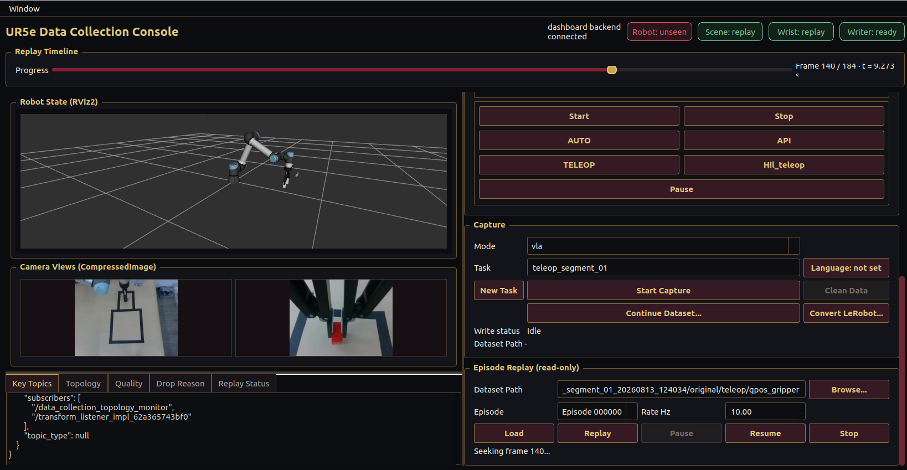
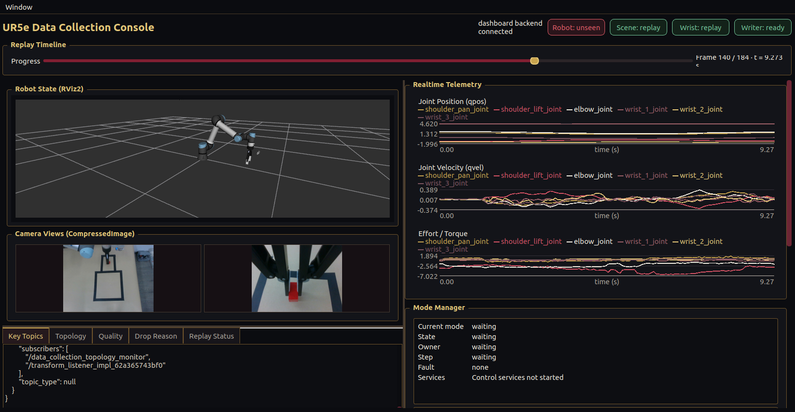
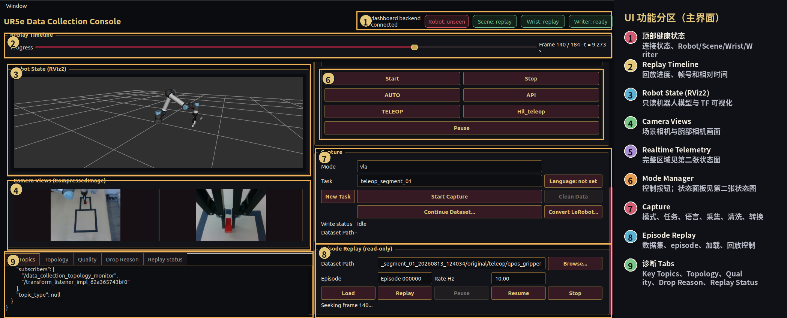
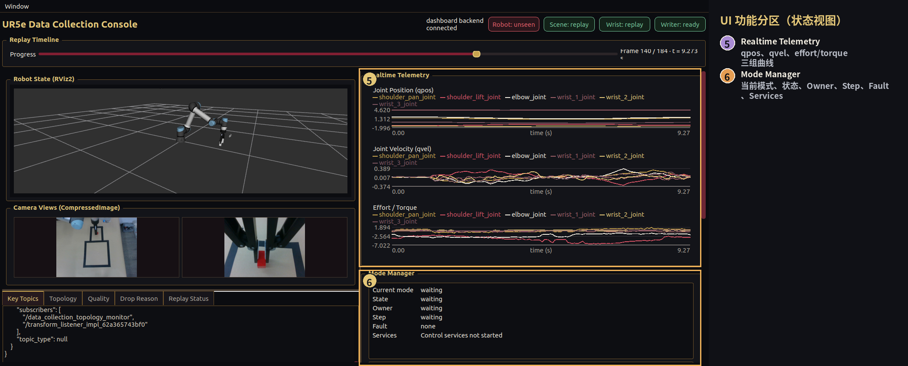

# UR5e Data Collection Console 用户手册

## 1. 文档说明

本手册介绍 `data_collection_rviz_panel` 提供的 Qt/RViz2 操作界面，覆盖启动前检查、窗口布局、模式管理、数据采集、结果标注、数据清洗、ACT/VLA/HDF5 转换、只读回放、状态诊断和常见故障处理。

面板是数据管道的操作入口，不是机器人控制器。它读取 ROS 2 话题和 Dashboard 状态，向 Dashboard API 发送数据操作请求，并通过模式管理器请求控制权切换。面板本身不会启动 UR 驱动，也不会把回放数据发送给真实机械臂控制器。

> 截图和功能分区图是仓库 `assets/` 目录中的可移植副本，部署到其他机器后仍可直接引用。

## 2. 界面快速认识







主界面截图中没有展开实时遥测曲线和 Mode Manager 状态面板，因此这两个区域使用另一张真实状态视图单独标注：



功能区编号与名称如下：

| 编号 | 区域 | 主要用途 |
| --- | --- | --- |
| 1 | 顶部健康状态 | 查看 Dashboard、机器人、两路相机和写入器状态 |
| 2 | Replay Timeline | 查看回放帧进度、帧号和相对时间；拖动可定位帧 |
| 3 | Robot State (RViz2) | 显示只读机器人模型和 TF |
| 4 | Camera Views | 显示场景相机和腕部相机 |
| 5 | Realtime Telemetry | 绘制关节位置、速度、力矩曲线 |
| 6 | Mode Manager | 启停控制服务并请求 AUTO/API/TELEOP/Hil_teleop/idle |
| 7 | Capture | 新建或继续数据集，采集、标注、清洗和导出 |
| 8 | Episode Replay | 加载数据集并只读回放指定 episode |
| 9 | 诊断 Tabs | 查看话题、拓扑、质量、丢帧原因和回放状态 |

窗口右侧为可滚动操作栏。窗口较矮时，遥测、模式、采集和回放区域仍可通过右侧滚动条访问；左侧 RViz、相机和底部诊断页保持可见。

## 3. 启动前准备

### 3.1 软件环境

- Ubuntu 22.04。
- ROS 2 Humble，并已执行 `source /opt/ros/humble/setup.bash`。
- 已构建并 source `data_collection_pkg` 与 `data_collection_rviz_panel`。
- Qt5、RViz2、`robot_state_publisher`、`tf2_ros` 和机器人描述包可用。
- 进行 LeRobot 转换时，按 `data_collection_pkg/requirements-lerobot.txt` 安装可选依赖。

### 3.2 外部运行时

按实际工作模式启动：

1. UR 驱动、机器人描述、相机驱动和夹爪驱动。
2. 独立模式管理器（提供 `/control_mode`、`/control_mode/request`、`/control_mode/status`）。
3. Dashboard API（默认由面板连接到 `127.0.0.1:8765`；控制服务健康检查使用 `127.0.0.1:5000/api/health`）。

面板启动命令：

```bash
source /opt/ros/humble/setup.bash
source install/setup.bash
ros2 launch data_collection_rviz_panel data_collection_rviz_panel.launch.py
```

该 launch 启动 Dashboard、只读 live/replay 模型和 Qt 面板，不替代真机驱动或模式管理器。若由其他 launch 统一启动这些服务，应确认没有重复启动同名节点。

### 3.3 只读硬件检查

开始采集前，建议确认关键话题已经发布：

```bash
ros2 topic list | rg 'joint_states|compressed|binary_gripper_state'
ros2 topic hz /joint_states
ros2 topic hz /camera2/scene_camera/color/image_raw/compressed
ros2 topic hz /camera1/wrist_camera/color/image_raw/compressed
```

当前二值夹爪状态通常为 `/binary_gripper_state`（`std_msgs/msg/Int8`，值为 `0` 或 `1`）。面板用于 RViz 模型显示的旧关节话题 `/robotiq_2f_gripper/joint_states` 可以继续发布；它与采集器读取的二值状态职责不同。

## 4. 顶部区域与健康状态

### 4.1 Dashboard 连接提示

- `dashboard backend connected`：最近一次 `/api/state` 请求成功。
- `dashboard backend disconnected`：请求失败或超时。采集、清洗、转换和回放控制请求不能可靠执行。

面板约每 500 ms 轮询一次状态，但同一时刻只允许一个 `/api/state` 请求在途；单次请求约 1.5 s 超时，避免网络阻塞造成请求堆积。

### 4.2 Robot、Scene、Wrist、Writer

| 显示 | 含义 | 建议动作 |
| --- | --- | --- |
| 绿色 | 当前数据有效且处于活动窗口，或正在显示回放 | 可继续观察/操作 |
| 黄色 | 曾经收到数据，但最近消息已 stale | 检查驱动、网络、ROS QoS 或话题频率 |
| 红色 | 尚未收到数据或当前不可用；写入器也可能已异常退出 | 查看 `Key Topics`、终端日志和外部节点 |

- **Robot**：依据 `/joint_states` 的 `seen`、`active` 和 `age_s`。
- **Scene**：依据场景压缩图像最近一帧；回放期间显示 `replay`。
- **Wrist**：依据腕部压缩图像最近一帧；回放期间显示 `replay`。
- **Writer**：依据 CaptureManager 是否可用、是否正在写入以及退出码。`writing` 表示正在采集，`ready` 表示可用，`stopped with error` 表示上次写入器异常结束。

健康 chip 是运行态提示，不是质量验收结论。最终是否接受 episode，应以清洗报告和 `Quality` 页为准。

## 5. Replay Timeline

时间轴是全局回放进度条。回放加载并开始后，右侧显示：

```text
Frame 当前帧 / 总帧数 · t = 相对起始时间（秒）
```

操作规则：

1. 先在 `Episode Replay` 中选择数据集并点击 `Load`。
2. 选择 episode 后点击 `Replay`，时间轴才会启用。
3. 拖动滑块可预览目标帧；松开鼠标后发送 seek 请求。
4. 回放处于 `running` 或 `paused` 且存在帧时才能 seek。
5. 真机话题 active 时，时间轴禁用，避免实时状态与回放状态同时显示。

## 6. Robot State (RViz2)

左侧 RViz 区域用于观察机器人姿态和坐标变换：

- live 模式显示只读的 `/data_collection/robot_model/joint_states`；
- replay 模式显示 `/data_collection/replay/joint_states`，并切换到 `replay/` TF 前缀；
- 该区域只可视化，不向真实控制器发送位置、速度或力矩命令；
- 如果模型不显示，优先检查 `robot_description`、`joint_states`、TF 和 RViz Fixed Frame。

面板会在 live/replay 状态改变时切换显示对象，并清空再重绘遥测曲线，避免把两个时间源混在一起。

## 7. Camera Views (CompressedImage)

相机区有两个画面：

- 左侧为场景相机 `/camera2/scene_camera/color/image_raw/compressed`；
- 右侧为腕部相机 `/camera1/wrist_camera/color/image_raw/compressed`。

订阅端使用 ROS 2 `SensorDataQoS`，适合高频传感器流，允许使用最新样本而不因旧帧堆积阻塞界面。相机消息的 `header.stamp` 用作采集同步锚点；相机到达面板的固定链路延迟只作为健康指标，不直接作为拒帧条件。

回放时，画面从 Dashboard 的 `/api/camera/external` 和 `/api/camera/wrist` 获取，与回放时间戳一起更新。实时话题重新 active 后，面板会停止回放并恢复 live 显示。

## 8. Realtime Telemetry

右侧遥测区包含三张曲线图：

1. **Joint Position (qpos)**：六个机械臂关节的位置。
2. **Joint Velocity (qvel)**：六个机械臂关节的速度。
3. **Effort / Torque**：关节力矩或 effort（是否有有效值取决于驱动发布）。

图例中的关节名来自消息的 `joint_names`。横轴为相对时间（秒），曲线由 Dashboard 的 `telemetry.latest` 和 `telemetry.history` 更新。回放 seek 发生跳帧时，面板使用历史数据重建曲线；live/replay 切换时清空旧曲线。

遥测用于观察运行趋势，不等同于控制器内部目标值。发现速度尖峰、力矩长期饱和或曲线停止刷新时，应结合 `Key Topics` 和硬件状态检查。

## 9. Mode Manager

### 9.1 状态字段

| 字段 | 含义 |
| --- | --- |
| `Current mode` | 当前控制模式，例如 `auto`、`api`、`teleop`、`hil_teleop`、`idle` |
| `State` | 模式管理器状态，例如 waiting、switching、running、fault |
| `Owner` | 当前控制权持有者 |
| `Step` | 切换流程当前步骤 |
| `Fault` | 最近故障；正常时为 `none` |
| `Services` | 控制服务是否已启动、停止或由外部管理 |

模式按钮通过 `/control_mode/request` 发布请求，并从 `/control_mode/status` 和 `/control_mode` 接收结果。面板不实现 ACT/VLA 策略，也不把采集分类当作控制器。

### 9.2 按钮

- **Start**：启动面板可管理的 HTTP API 和模式管理器进程。若检测到已有外部服务，面板不会重复启动，并提示 `externally managed`。
- **Stop**：停止面板拥有的控制服务。停止过程按 SIGINT、SIGTERM、SIGKILL 的渐进策略等待进程退出；外部拥有的进程不应由面板强制杀死。
- **AUTO**：请求 `auto` 控制模式。
- **API**：请求 `api` 控制模式，供外部 HTTP/API 控制器使用。
- **TELEOP**：请求 `teleop` 控制模式，通常用于人工遥操作。
- **Hil_teleop**：请求 `hil_teleop` 控制模式；是否复位机械臂由外部 `pika_teleop` 参数决定。
- **Pause**：请求 `idle`，用于暂停控制。按钮文字保持英文 `Pause`，不是暂停采集。

模式切换期间（`switching`）模式按钮会暂时禁用，防止并发请求。约 1.5 s 未收到模式状态时，面板会把状态视为不可用并重新允许必要操作。

### 9.3 HIL 使用建议

HIL 场景下，先在外部控制器准备完成后点击 `AUTO`，需要人工接管时点击 `Pause` 进入 `idle`，确认机械臂停止后再点击 `Hil_teleop`。回到自动控制前，应先确认遥操作节点已释放控制权，再请求 `AUTO`。任何切换都必须由现场人员保持急停可用并观察机器人。

## 10. Capture 数据采集

### 10.1 Capture 区控件

| 控件 | 作用 |
| --- | --- |
| `Mode` | 选择数据目录分类：`teleop`、`http`、`act`、`vla` |
| `Task` | 新任务的名称；继续已有数据集时由数据集元数据填充并锁定 |
| `Language: not set/ready` | 打开语言指令编辑器并显示当前语言状态 |
| `New Task` | 创建新的任务根目录并清除当前数据集选择 |
| `Start Capture` / `Stop Capture` | 启动或停止固定频率采集 |
| `Clean Data` | 对当前原始数据执行质量清洗 |
| `Continue Dataset...` | 选择已有原始数据集并继续追加 episode |
| `Convert...` | 单独选择 cleaned 数据集并导出 ACT、VLA 或 HDF5 |
| `Write status` | 显示 Idle、采集、清洗、标注或错误信息 |
| `Dataset Path` | 显示当前选中的数据集目录 |

四种 Mode 是采集分类，不是控制器：

- `teleop`：记录人工遥操作数据，通常用于训练 ACT/VLA。
- `http`：记录 HTTP/API 控制下的数据。
- `act`：记录 ACT 控制模式下的数据。
- `vla`：记录 VLA 控制模式下的数据，并应保存语言指令。

CaptureManager 只启动 collector；实际控制模式由 Mode Manager 和外部控制节点切换。

### 10.2 Start Capture 的采样参数

面板当前发送的默认参数为：

```text
sample_rate_hz = 15.0
sampling_clock = scene_camera_header
camera_sync_tolerance_s = 0.02
joint_state_sync_tolerance_s = 0.02
gripper_sync_tolerance_s = 0.03
```

含义：

- 每秒目标 15 个采样点；相机通常约 30 Hz，采集器按时间间隔确定性下采样。
- 场景相机 `header.stamp` 是每个 observation 的时间锚点。
- 以该时间在状态缓冲区匹配腕部相机和关节状态。
- 二值夹爪消息没有 header，当前按接收时间匹配，因此保留 30 ms 容差。
- 相机接收延迟健康阈值约 50 ms，只用于告警，不作为同步拒帧条件。

采集器维持固定频率，不采用 action 触发；ACT/VLA 控制下也会按相同频率采集，便于离线训练和后续分析。

### 10.3 新建任务采集

1. 点击 `New Task`。
2. 在 `Task` 中输入任务名称。
3. 按需打开 `Language` 填写 task ID、英文指令和中文指令。
4. 在 `Mode` 中选择采集分类。
5. 确认顶部 Robot、Scene、Wrist、Writer 状态正常。
6. 点击 `Start Capture`。
7. 执行一个完整动作；结束后点击 `Stop Capture`。
8. 在 `Capture Outcome` 对话框选择 `Success` 或 `Failure`。

原始数据写入 `original/<mode>/qpos_gripper`。如果在结果对话框点击 `Cancel`，采集会停止，但 episode 保持未审核状态，清洗时可能进入 `needs review` 或因缺少 outcome 被拒绝。

### 10.4 继续已有数据集

1. 点击 `Continue Dataset...`。
2. 选择包含 `meta/episodes.jsonl` 的原始 `qpos_gripper` 目录。
3. 面板读取已有任务、模式和语言标注；Task 名称锁定，防止误改根目录。
4. 需要把不同任务放入同一数据集时，修改 Language 指令并保存；采集 Mode 可以切换到另一个分类。
5. 点击 `Start Capture` 追加新 episode。

继续采集会在既有 episode 索引之后追加，更新元数据索引，不覆盖已有 episode。建议每次停止后都完成 Success/Failure 标注，再开始下一段采集。

### 10.5 语言指令

语言编辑器包含：

- `Task ID`：可手工填写，也可从已有标签选择；
- `English instruction`：VLA 推荐填写的英文任务描述；
- `中文指令`：便于人工记录和检索的中文描述；
- `Save`、`Cancel`：保存或放弃本次编辑。

英文指令变化时，面板会生成 task ID 建议；手工输入的 task ID 会保留。保存后显示 `Language: ready`，下一次 Start Capture 才会将字段传给后端。没有语言指令仍可采集，但该 episode 不满足 VLA 合格导出的语言条件。

## 11. 停止采集与人工 outcome

点击 `Stop Capture` 后，面板先请求 collector 安全停止并等待写盘完成，再弹出结果选择：

- **Success**：保存 `success` outcome；
- **Failure**：保存 `failure` outcome；
- **Cancel**：不提交 outcome，episode 保持未审核。

状态文字示例：

```text
Saving capture outcome...
Outcome saved: success (1 episode(s))
Capture stopped: outcome unreviewed
```

如果点击 Success 后仍看到 `outcome missing`，应查看 `Write status` 是否出现 `Outcome not saved`，并检查 Dashboard API 是否在标注请求期间可达。标注请求与停止请求是两个独立 HTTP 请求，网络中断可能导致“采集已停但标注未保存”。

## 12. Clean Data

### 12.1 使用流程

1. 确认没有正在采集。
2. 在 Capture 区已加载原始数据集。
3. 点击 `Clean Data`。
4. 确认对话框中的数据集目录和“原始文件不修改”提示。
5. 等待清洗完成，观察 accepted/rejected/needs review 统计。

当前面板默认清洗参数：

```text
target_fps = 15.0
max_sync_delta_s = 0.02
fps_tolerance_ratio = 0.5
```

清洗在 cleaned sibling 目录生成结果，原始目录保持不变。质量门禁会检查帧间隔、同步、图像、关节、夹爪、元数据和 outcome；具体拒绝原因在 `Drop Reason` 和报告中查看。

### 12.2 质量结果解读

- `accepted`：通过质量门禁，可用于后续转换。
- `rejected`：至少一个硬性条件不满足，不进入合格数据集。
- `needs review`：质量基本可读，但需要人工确认，不能直接视为训练合格。

`frame_dt_out_of_range` 表示帧间隔超出目标频率允许范围；`outcome_missing` 表示 episode 没有保存 Success/Failure 标注。两者是数据质量问题，不是相机显示问题。

## 13. Convert（ACT / VLA / HDF5）

### 13.1 操作流程

1. 点击 `Convert...`，选择 `ACT`、`VLA` 或 `HDF5`。
2. 选择 cleaned `qpos_gripper` 数据集，必须包含 `meta/episodes.jsonl`。
3. ACT/VLA 选择输出父目录和输出目录名；HDF5 直接选择输出文件，文件名不带扩展名时 UI 自动补充 `.hdf5`。
4. ACT 直接进入异步导出；VLA 先显示 preflight 结果；HDF5 检查输入元数据后进入异步导出。
5. VLA 确认 eligible/skipped episode 和计划报告后开始导出。
6. 观察状态文字和不确定进度条；完成或失败后进度条停止。

ACT/VLA 输出 LeRobot v3 目录；HDF5 输出项目自定义 HDF5 v1 单文件，包含 state/action、时间戳、双路 RGB 图像、episode 索引和语言元数据，不宣称兼容任意训练框架。转换状态使用 `queued`、`running`、`done`、`failed`，不伪造百分比。典型文字：

```text
HDF5 export queued...
HDF5 export running...
HDF5 export complete: ...
HDF5 export failed: ...
```

VLA 需要有效语言标注；没有语言的 episode 会在 preflight 中列为 skipped。ACT 与 VLA 使用同一 LeRobot v3 输出结构，HDF5 使用项目自定义 HDF5 v1 结构。HDF5 不是任意训练框架的通用输入，使用前应确认下游读取器按本项目 schema 读取。

### 13.2 独立 API 对照

| API | 用途 |
| --- | --- |
| `POST /api/capture/export-lerobot/preflight` | VLA 导出前检查 |
| `POST /api/capture/export-lerobot` | 启动 ACT/VLA LeRobot 异步转换（兼容接口） |
| `GET /api/capture/export-lerobot/status` | 查询转换状态 |
| `POST /api/capture/export` | 按 `format=act|vla|hdf5` 启动通用异步转换 |
| `GET /api/capture/export/status` | 查询通用转换状态 |

HDF5 输出至少包含 `meta/episode_index`、`meta/episode_lengths`、`meta/episode_ends`、`meta/tasks/*`，以及每个 episode 下的 `observations/state`、`actions`、`timestamps`、`frame_index`、`observations/images/top` 和 `observations/images/wrist`。完成转换后应使用项目校验器确认 `ok=true` 且 `issues=[]`。

若转换长时间停在某个 episode，应查看 Write status、Dashboard 日志和输出目录中的计划/错误报告；不要同时启动第二个同目录转换。

## 14. Episode Replay（只读回放）

### 14.1 控件说明

| 控件 | 作用 |
| --- | --- |
| `Dataset Path` | 要回放的 `qpos_gripper` 数据集 |
| `Browse...` | 选择数据集目录 |
| `Episode` | 选择已有 episode |
| `Rate Hz` | 回放发布频率，范围 0.1--60 Hz，默认 10 Hz |
| `Load` | 读取 episode 列表 |
| `Replay` | 开始回放 |
| `Pause` | 暂停回放 |
| `Resume` | 继续回放 |
| `Stop` | 停止并回到空闲状态 |

### 14.2 回放流程

1. 确认真机 `/joint_states` 和两路相机没有 active 数据，或先停止相关 live publisher。
2. 选择数据集目录并点击 `Load`。
3. 选择 episode 和 `Rate Hz`。
4. 点击 `Replay`。
5. 使用全局时间轴 seek，或使用 `Pause`、`Resume`、`Stop` 控制。

### 14.3 安全保护

- 检测到 `/joint_states` 或任一路相机 live topic active 时，Replay 按钮和时间轴会变灰。
- 回放期间检测到 live topic 恢复，面板会请求停止回放。
- live 模型与 replay 模型互斥显示；相机也在 live/replay 数据源之间切换。
- 回放只发布 `/data_collection/replay/joint_states` 和带 `replay/` 前缀的 TF，不向真实机械臂控制器发布运动命令。

如果回放画面被真机状态覆盖，先停止 live publisher/驱动，再重新 Load 和 Replay；仅停止相机不一定足够，因为 `/joint_states` 仍可能触发 live 保护。

## 15. 左下角诊断 Tabs

### 15.1 Key Topics

显示 Dashboard `flow_status.topics`。每个话题通常包含：

- `seen`：是否曾经收到消息；
- `active`：是否在活动窗口内持续收到消息；
- `age_s`：距最近消息的秒数；
- `publisher_count` / `subscriber_count`：ROS graph 端点数量；
- `topic_type`：ROS 消息类型。

状态含义：`active` 可用，`stale` 曾有数据但已超时，`unseen` 从未收到。`publisher_count` 为 0 时，先检查驱动是否启动；采集节点未启动时 subscriber count 为 0 是正常的。

### 15.2 Topology

显示节点和话题的连接图，通常以 `from -> to` 和 topic 边表示。可用于确认相机/关节驱动是否连接 collector、collector 是否连接 writer、回放 publisher 是否出现，以及是否存在错误中转节点。

### 15.3 Quality

显示 `/data_collection/quality_status` 的 JSON 状态，包括当前质量检查、同步、频率、图像、关节、夹爪和清洗统计。它描述数据是否合格，不描述控制器是否拥有控制权；控制权应看 Mode Manager。

### 15.4 Drop Reason

显示 `/data_collection/drop_reason` 的最新丢帧或拒绝原因。常见原因：

| 原因 | 处理方向 |
| --- | --- |
| `missing_topic` / `missing_timestamp` | 检查话题、消息类型和 header |
| `stale_topic` | 检查驱动频率、网络和 QoS |
| `camera_sync...` | 检查两路相机 header 时间和同步容差 |
| `joint_sync...` | 检查 `/joint_states` 时间戳和状态缓冲 |
| `gripper_sync...` | 检查二值夹爪发布；当前容差为 30 ms |
| `frame_dt_out_of_range` | 检查采样频率和定时器抖动 |
| `missing_image` | 检查 JPEG/CompressedImage 数据 |
| `outcome_missing` | 停止采集后在对话框选择 Success 或 Failure |
| `language_missing` | 为 VLA episode 保存语言指令 |
| `invalid_metadata` | 检查 `meta/episodes.jsonl` 和索引 |

### 15.5 Replay Status

显示 `/data_collection/replay/status`：

- `status`：idle、started、running、paused、stopped、done 或 failed；
- `episode_index`：当前 episode；
- `published_frames`、`frame_count`、`frame_index`：发布和进度；
- `timestamp`、`start_timestamp`：当前时间戳和回放起点。

## 16. 常见问题排查

### 面板打开但没有模型

确认 `robot_description` 已发布，`/joint_states` 有数据，RViz Fixed Frame 与 TF 树一致，并检查终端是否出现 `robot_state_publisher` 错误。面板连接 Dashboard 不代表 RViz 模型输入已经就绪。

### 点击 Start Capture 后立即结束

检查 Dashboard 是否可达、collector 是否能启动、四个关键话题是否已发布，以及任务目录是否有写权限。查看 `Write status`、`Writer` chip 和 Dashboard 日志；若没有语言指令，按当前设计仍应允许采集，语言不是 teleop 启动的必要条件。

### Stop 按钮不可用或提示 externally managed

面板只停止它自己拥有的进程。若模式管理器或 HTTP API 是由 launch、systemd 或其他终端启动，面板会显示外部管理并避免误杀。应在原启动方停止服务，或先确认没有外部实例再点击 Start。

### Continue 后任务名看起来不对

Continue 读取数据集元数据中的任务名称，并锁定 Task 输入框以保护原目录。要开始完全不同的任务，先点击 `New Task`；要在同一目录加入不同语言任务，使用 Language 编辑器修改 task ID/指令后再采集。

### Language 保存后又显示旧指令

确认在编辑器中点击 `Save` 而非 `Cancel`，并等待按钮恢复。Continue 数据集的已有标注来自后端元数据；修改后应重新打开编辑器验证，下一次 Start Capture 才会使用新值。

### Clean Data 按钮灰色

采集进行中、清洗进行中、未选择数据集或数据集路径为空时会禁用。先 Stop Capture 并完成 outcome，再选择或 Continue 一个原始数据集。

### Replay 按钮灰色

这是实时话题保护的预期行为。检查 `Key Topics` 中 `/joint_states`、场景相机和腕部相机是否 active；停止 live publisher 后等待状态刷新，再 Load 数据集。

### LeRobot 转换没有窗口或看似无响应

转换在后台执行，不打开新终端窗口。确认选择的是 cleaned `qpos_gripper` 且存在 `meta/episodes.jsonl`，观察状态文字和忙碌进度条。VLA 还需先完成 preflight；检查输出父目录权限和磁盘空间。

## 17. 安全与数据管理建议

- 真机操作时，现场必须保留急停和可视监护；不要把 Replay 当作控制命令测试工具。
- 切换模式前确认当前 Owner 和 State，避免两个控制器同时持有控制权。
- 采集前先确认 Writer 为 ready，采集结束后等待 outcome 保存完成。
- 清洗不会修改 original；不要在清洗或转换期间手动删除目录。
- 不要同时对同一输出目录启动多个 LeRobot 转换。
- 定期备份 original 和 cleaned 数据集中的元数据与质量报告。

## 18. 接口与话题速查

### Dashboard API

| 方法 | 路径 | 用途 |
| --- | --- | --- |
| GET | `/api/state` | 全部状态、拓扑、质量、遥测、回放和采集状态 |
| GET | `/api/health` | 控制 API 健康检查 |
| POST | `/api/capture/start` | 启动采集 |
| POST | `/api/capture/stop` | 停止采集 |
| POST | `/api/capture/annotate` | 保存 episode outcome |
| POST | `/api/capture/new-task` | 创建新任务 |
| POST | `/api/capture/select-existing-dataset` | 选择并继续已有数据集 |
| GET | `/api/capture/task-labels` | 读取语言标签 |
| POST | `/api/capture/clean` | 清洗原始数据 |
| POST | `/api/capture/export-lerobot/preflight` | 导出前检查 |
| POST | `/api/capture/export-lerobot` | 启动异步导出 |
| GET | `/api/capture/export-lerobot/status` | 查询导出状态 |
| GET | `/api/replay/episodes` | 读取 episode 列表 |
| POST | `/api/replay/start` | 开始回放 |
| POST | `/api/replay/pause` | 暂停回放 |
| POST | `/api/replay/resume` | 继续回放 |
| POST | `/api/replay/stop` | 停止回放 |
| POST | `/api/replay/seek` | 定位到指定帧 |

### ROS 话题

| 话题 | 用途 |
| --- | --- |
| `/joint_states` | 机器人关节 live 状态和采集同步 |
| `/robotiq_2f_gripper/joint_states` | RViz 兼容的夹爪关节显示（旧话题可继续发布） |
| `/binary_gripper_state` | 采集器使用的 0/1 夹爪状态 |
| `/camera2/scene_camera/color/image_raw/compressed` | 场景相机输入和采样锚点 |
| `/camera1/wrist_camera/color/image_raw/compressed` | 腕部相机输入 |
| `/control_mode/request` | 模式切换请求 |
| `/control_mode` | 当前模式 |
| `/control_mode/status` | 模式管理器详细状态 |
| `/data_collection/quality_status` | 质量状态 |
| `/data_collection/drop_reason` | 丢帧原因 |
| `/data_collection/replay/status` | 回放状态 |
| `/data_collection/replay/joint_states` | 只读回放关节状态 |

## 19. 一次完整工作流

```text
启动驱动与模式管理器
        ↓
启动 Dashboard 与 Qt/RViz 面板
        ↓
确认顶部健康 chip 和 Key Topics
        ↓
New Task 或 Continue Dataset
        ↓
选择 Mode，填写 Task/Language
        ↓
Start Capture → 执行动作 → Stop Capture
        ↓
选择 Success/Failure 并等待保存
        ↓
Clean Data → 检查 Quality/Drop Reason
        ↓
Convert → ACT、VLA 或 HDF5 导出
        ↓
停止 live publisher 后 Load → Replay（只读）
```

完成上述流程后，original、cleaned 和 LeRobot 数据集可以分别用于原始归档、质量筛选和训练/验证。任何异常都应先保留原始数据和报告，再进行修复或重新采集。
